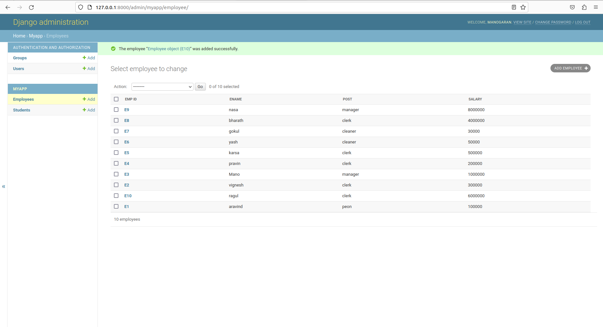

# Django ORM Web Application

## AIM
To develop a Django application to store and retrieve data from a database using Object Relational Mapping(ORM).


## DESIGN STEPS

### STEP 1:
Clone the problem from GitHub.

### STEP 2:
Create a new app in Django Project.

### STEP 3:
Enter the code for admin.py and models.py

### STEP 4;
Execute Django admin and create 5 employee.

## PROGRAM
```
admin.py

from django.contrib import admin
from .models import Student,StudentAdmin,Employee,EmployeeAdmin


admin.site.register(Student,StudentAdmin)
admin.site.register(Employee,EmployeeAdmin)


models.py

from django.db import models
from django.contrib import admin


class Student (models.Model):
    referencenumber=models.CharField(max_length=20,help_text="reference number")
    name=models.CharField(max_length=100)
    age=models.IntegerField()
    email=models.EmailField()


class StudentAdmin(admin.ModelAdmin):
    list_display=('referencenumber','name','age','email')
class Employee (models.Model):
    emp_id=models.CharField(primary_key=True,max_length=4,help_text='Employee ID')
    ename=models.CharField(max_length=50)
    post=models.CharField(max_length=20)
    salary=models.IntegerField()


class EmployeeAdmin(admin.ModelAdmin):
    list_display=('emp_id','ename','post','salary')

```

## OUTPUT



## RESULT
Thus the program for creating a database using ORM has been executed successfully.